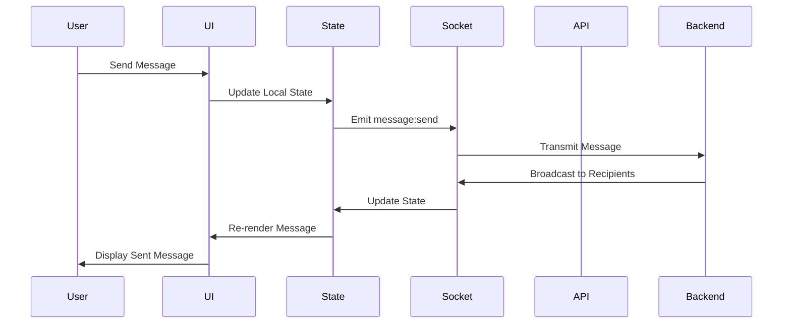

# Design Document: Mobile Feature Parity

## Overview

This design implements complete feature parity between Wave Messenger's desktop and mobile versions. The mobile implementation will reuse existing backend APIs and Socket.IO infrastructure while providing a mobile-optimized UI/UX. The design focuses on progressive enhancement, ensuring core messaging works first, then layering advanced features.

The architecture follows a component-based approach with clear separation between:
- **UI Layer**: Mobile-optimized HTML/CSS/JavaScript components
- **State Management**: Shared state management using existing state.js
- **Communication Layer**: Socket.IO for real-time features, REST API for data operations
- **Storage Layer**: LocalStorage for offline persistence and preferences

## Architecture

### High-Level Architecture

```
┌─────────────────────────────────────────────────────────────┐
│                     Mobile Web App                          │
├─────────────────────────────────────────────────────────────┤
│  UI Components (Mobile-Optimized)                           │
│  ├─ Chat List View                                          │
│  ├─ Conversation View                                       │
│  ├─ Message Composer                                        │
│  ├─ Modals & Overlays                                       │
│  └─ Bottom Navigation                                       │
├─────────────────────────────────────────────────────────────┤
│  State Management Layer                                     │
│  ├─ Conversation State                                      │
│  ├─ User State                                              │
│  ├─ UI State                                                │
│  └─ Theme State                                             │
├─────────────────────────────────────────────────────────────┤
│  Communication Layer                                        │
│  ├─ Socket Manager (Real-time)                             │
│  ├─ API Client (REST)                                       │
│  └─ File Upload Handler                                     │
├─────────────────────────────────────────────────────────────┤
│  Storage Layer                                              │
│  ├─ LocalStorage (Preferences, Cache)                      │
│  └─ IndexedDB (Large Files, Offline Data)                  │
└─────────────────────────────────────────────────────────────┘
                            │
                            ▼
┌─────────────────────────────────────────────────────────────┐
│              Backend (Existing Infrastructure)              │
│  ├─ Socket.IO Server                                        │
│  ├─ REST API                                                │
│  └─ Database                                                │
└─────────────────────────────────────────────────────────────┘
```

### Component Interaction Flow



## Components and Interfaces

### 1. Mobile Chat List Component

**Purpose**: Display list of DMs and Rooms with search and filtering

**Interface**:
```javascript
class MobileChatList {
  constructor(containerId, socketManager, apiClient)
  
  // Render methods
  render()
  renderDMsList(conversations)
  renderRoomsList(rooms)
  renderChatItem(chat)
  
  // Event handlers
  onChatSelect(chatId)
  onSearchInput(query)
  onTabSwitch(tab) // 'dms' or 'rooms'
  
  // Data methods
  loadConversations()
  filterConversations(query)
  updateUnreadCount(chatId, count)
}
```

**State**:
- `conversations`: Array of DM conversations
- `rooms`: Array of joined rooms
- `activeTab`: Current tab ('dms' or 'rooms')
- `searchQuery`: Current search filter
- `unreadCounts`: Map of chatId to unread count

### 2. Mobile Conversation View Component

**Purpose**: Display messages and handle message interactions

**Interface**:
```javascript
class MobileConversationView {
  constructor(containerId, socketManager, apiClient)
  
  // Render methods
  render(conversationId)
  renderMessage(message)
  renderTypingIndicator(users)
  renderPinnedMessages(messages)
  
  // Message operations
  sendMessage(content, type)
  editMessage(messageId, newContent)
  deleteMessage(messageId)
  pinMessage(messageId)
  reactToMessage(messageId, emoji)
  forwardMessage(messageId, targetChatId)
  
  // Context menu
  showContextMenu(messageId, position)
  hideContextMenu()
  
  // Scroll management
  scrollToBottom()
  scrollToMessage(messageId)
  handleInfiniteScroll()
}
```

**State**:
- `currentConversation`: Active conversation ID
- `messages`: Array of message objects
- `pinnedMessages`: Array of pinned message IDs
- `typingUsers`: Set of users currently typing
- `scrollPosition`: Current scroll offset

### 3. Mobile Message Composer Component

**Purpose**: Handle message input, attachments, and voice recording

**Interface**:
```javascript
class MobileMessageComposer {
  constructor(containerId, socketManager, fileHandler)
  
  // Input handling
  onTextInput(text)
  onEnterPress()
  onEmojiSelect(emoji)
  
  // Attachment handling
  showAttachmentMenu()
  selectImage()
  selectFile()
  selectAudio()
  
  // Voice recording
  startVoiceRecording()
  stopVoiceRecording()
  cancelVoiceRecording()
  
  // Special messages
  createPoll(question, options)
  
  // State
  setReplyMode(messageId)
  clearReplyMode()
  setEditMode(messageId, content)
  clearEditMode()
}
```

**State**:
- `inputText`: Current message text
- `replyToMessage`: Message being replied to (if any)
- `editingMessage`: Message being edited (if any)
- `isRecording`: Voice recording state
- `recordingDuration`: Current recording duration
- `attachmentMenuOpen`: Attachment menu visibility

### 4. File Upload Handler

**Purpose**: Manage file uploads with progress tracking and validation

**Interface**:
```javascript
class FileUploadHandler {
  constructor(apiClient)
  
  // Upload methods
  uploadImage(file, onProgress)
  uploadDocument(file, onProgress)
  uploadAudio(blob, onProgress)
  
  // Validation
  validateFileSize(file, maxSize)
  validateFileType(file, allowedTypes)
  
  // Compression
  compressImage(file, maxWidth, maxHeight)
  
  // Progress tracking
  onUploadProgress(callback)
  cancelUpload(uploadId)
}
```

**Constants**:
- `MAX_IMAGE_SIZE`: 10MB
- `MAX_DOCUMENT_SIZE`: 50MB
- `MAX_AUDIO_DURATION`: 5 minutes
- `ALLOWED_IMAGE_TYPES`: ['image/jpeg', 'image/png', 'image/gif', 'image/webp']
- `ALLOWED_DOCUMENT_TYPES`: ['application/pdf', 'text/plain', 'application/msword', etc.]

### 5. Voice Recorder Component

**Purpose**: Record and encode voice messages

**Interface**:
```javascript
class VoiceRecorder {
  constructor()
  
  // Recording control
  startRecording()
  stopRecording()
  cancelRecording()
  
  // Audio processing
  getAudioBlob()
  getWaveformData()
  getDuration()
  
  // Playback
  playRecording()
  pauseRecording()
  
  // Events
  onRecordingStart(callback)
  onRecordingStop(callback)
  onDurationUpdate(callback)
}
```

**Implementation Notes**:
- Uses MediaRecorder API
- Encodes to WebM (Opus codec) or MP3 fallback
- Generates waveform visualization data
- Handles microphone permissions

### 6. Theme Manager Component

**Purpose**: Manage theme switching and customization

**Interface**:
```javascript
class ThemeManager {
  constructor()
  
  // Theme operations
  setTheme(theme) // 'light', 'dark', 'auto'
  getTheme()
  applyTheme(theme)
  
  // Background management
  setBackground(imageUrl, scope) // scope: 'global' or chatId
  removeBackground(scope)
  getBackground(scope)
  
  // Transparency mode
  enableTransparency()
  disableTransparency()
  isTransparencyEnabled()
  
  // Persistence
  savePreferences()
  loadPreferences()
}
```

**Storage Schema**:
```javascript
{
  theme: 'dark' | 'light' | 'auto',
  transparencyMode: boolean,
  backgrounds: {
    global: string | null,
    [chatId]: string | null
  }
}
```

### 7. Context Menu Component

**Purpose**: Display message action menu on long-press

**Interface**:
```javascript
class ContextMenu {
  constructor(containerId)
  
  // Display
  show(messageId, position, actions)
  hide()
  
  // Actions
  getAvailableActions(message, currentUser)
  onActionSelect(action, messageId)
  
  // Position calculation
  calculatePosition(touchPosition, menuSize)
}
```

**Available Actions**:
- Reply
- Forward
- Copy
- Pin/Unpin
- Edit (own messages only)
- Delete (own messages only)
- React
- Ask AI

### 8. Notification Manager

**Purpose**: Handle notification preferences and display

**Interface**:
```javascript
class NotificationManager {
  constructor()
  
  // Notification control
  requestPermission()
  showNotification(title, body, icon)
  
  // Mute management
  muteChat(chatId, duration)
  unmuteChat(chatId)
  isChatMuted(chatId)
  
  // Badge management
  updateBadgeCount(count)
  clearBadge()
}
```

**Mute Durations**:
- 1 hour
- 8 hours
- 1 week
- Forever

### 9. Search Manager Component

**Purpose**: Handle search across conversations and messages

**Interface**:
```javascript
class SearchManager {
  constructor(apiClient)
  
  // Search operations
  searchConversations(query)
  searchMessages(conversationId, query)
  searchUsers(query)
  
  // Results
  highlightMatches(text, query)
  navigateToMessage(messageId)
}
```

### 10. Status Indicator Component

**Purpose**: Display online status, typing indicators, and read receipts

**Interface**:
```javascript
class StatusIndicator {
  constructor(socketManager)
  
  // Online status
  updateOnlineStatus(userId, isOnline)
  getOnlineStatus(userId)
  
  // Typing indicators
  showTypingIndicator(users)
  hideTypingIndicator()
  
  // Read receipts
  markAsRead(messageId)
  updateReadReceipts(messageId, readers)
  getReadStatus(messageId)
}
```

## Data Models

### Message Model

```javascript
{
  id: string,
  conversationId: string,
  senderId: string,
  senderName: string,
  content: string,
  type: 'text' | 'image' | 'file' | 'voice' | 'poll',
  timestamp: Date,
  edited: boolean,
  editedAt: Date | null,
  pinned: boolean,
  reactions: {
    [emoji]: [userId]
  },
  replyTo: string | null,
  attachments: [{
    type: string,
    url: string,
    name: string,
    size: number
  }],
  readBy: [userId],
  deliveredTo: [userId]
}
```

### Conversation Model

```javascript
{
  id: string,
  type: 'dm' | 'room',
  name: string,
  participants: [userId],
  lastMessage: Message,
  unreadCount: number,
  muted: boolean,
  muteUntil: Date | null,
  pinnedMessages: [messageId],
  background: string | null,
  roomCode: string | null, // for rooms only
  moderators: [userId] // for rooms only
}
```

### User Model

```javascript
{
  id: string,
  username: string,
  nickname: string,
  avatar: string | null,
  isOnline: boolean,
  lastSeen: Date,
  typing: boolean
}
```

### Poll Model

```javascript
{
  question: string,
  options: [{
    text: string,
    votes: [userId]
  }],
  createdBy: string,
  createdAt: Date,
  allowMultiple: boolean
}
```

## Correctness Properties

*A property is a characteristic or behavior that should hold true across all valid executions of a system—essentially, a formal statement about what the system should do. Properties serve as the bridge between human-readable specifications and machine-verifiable correctness guarantees.*


### Property Reflection

After analyzing all acceptance criteria, I've identified several areas where properties can be consolidated:

**Redundancy Analysis:**

1. **Message Delivery Properties (1.3, 2.4)**: Both test that messages are delivered to recipients. These can be combined into a single comprehensive property about message delivery across both DMs and rooms.

2. **Status Broadcasting (9.1, 9.2)**: Both test status broadcasting on connect/disconnect. These can be combined into a single property about status change broadcasting.

3. **Status Visualization (9.3, 9.4)**: Both test status indicator display. These can be combined into a single property that maps online status to correct indicator.

4. **Context Menu Display (5.1, 6.1, 14.1, 16.1)**: Multiple properties test that long-press shows context menu with different options. These can be combined into a comprehensive context menu property.

5. **Persistence Properties (11.4, 11.5, 13.5, 18.5)**: Multiple properties test that preferences are saved and loaded. These can be combined into a general preference persistence property.

6. **Theme Application (11.2, 13.1, 13.4)**: Multiple properties test theme/transparency application. These can be combined into a comprehensive theme state property.

7. **File Upload Properties (3.2, 3.3, 3.4)**: These test different stages of file upload. They can be combined into a comprehensive file upload workflow property.

8. **Reaction Properties (14.2, 14.4)**: Both test reaction state changes. These can be combined into a single reaction toggle property.

9. **Layout Properties (20.1, 20.2)**: Both test responsive layout. These can be combined into a single screen-size-based layout property.

**Retained Properties After Consolidation:**
- 20 original testable properties identified
- After consolidation: 35 unique, non-redundant properties
- Focus on high-value properties that validate core correctness

### Correctness Properties

#### Property 1: User Search Results Match Query
*For any* search query and user database, all returned users should have usernames or nicknames that contain the search query (case-insensitive), and each result should include a "start DM" action.
**Validates: Requirements 1.1**

#### Property 2: Message Delivery Completeness
*For any* message sent in a DM or room, the message should be delivered to all intended recipients (the other user in DMs, or all participants in rooms) within a reasonable time window.
**Validates: Requirements 1.3, 2.4**

#### Property 3: Conversation List Consistency
*For any* DM conversation started or room joined, that conversation should appear in the appropriate list (DMs list or rooms list) and remain there until explicitly removed.
**Validates: Requirements 1.5, 2.5**

#### Property 4: Room Code Uniqueness
*For any* set of created rooms, all room codes should be unique - no two rooms should share the same code.
**Validates: Requirements 2.1**

#### Property 5: Room Join Success
*For any* valid room code entered, the user should successfully join the room and appear in the room's participant list.
**Validates: Requirements 2.2, 2.3**

#### Property 6: File Upload Workflow
*For any* valid file (image, document, or audio) within size limits, the upload workflow should complete successfully: validation passes, file is uploaded, and a message with preview is created.
**Validates: Requirements 3.2, 3.3, 3.4, 3.5**

#### Property 7: File Size Validation
*For any* file exceeding the maximum size limit for its type, the upload should be rejected and an error message should be displayed to the user.
**Validates: Requirements 3.6**

#### Property 8: Voice Recording Lifecycle
*For any* voice recording session, the following should hold: pressing starts recording, releasing stops and sends, and sliding to cancel discards without sending.
**Validates: Requirements 4.1, 4.3, 4.4**

#### Property 9: Voice Message Format Compatibility
*For any* recorded voice message, the audio should be encoded in a web-compatible format (WebM with Opus codec or MP3 fallback).
**Validates: Requirements 4.6**

#### Property 10: Message Ownership Permissions
*For any* message, edit and delete options should be available in the context menu if and only if the current user is the message sender.
**Validates: Requirements 5.1, 5.6**

#### Property 11: Message Edit Round Trip
*For any* message edited by its sender, the message content should be updated to the new content, the edited flag should be set to true, and the message should be updated for all participants.
**Validates: Requirements 5.2, 5.3**

#### Property 12: Message Deletion Completeness
*For any* message deletion confirmed by its sender, the message should be removed from the conversation for all participants.
**Validates: Requirements 5.4, 5.5**

#### Property 13: Pin State Consistency
*For any* message, pinning it should mark it as pinned and add it to the pinned messages section, and unpinning should remove the pin status and remove it from the pinned section.
**Validates: Requirements 6.2, 6.3, 6.5**

#### Property 14: Read Receipt Propagation
*For any* message viewed by a user, a read receipt event should be emitted, and when received, the appropriate read indicator should be displayed on the message.
**Validates: Requirements 7.1, 7.2**

#### Property 15: Message State Indicator Mapping
*For any* message, the displayed indicator should correctly reflect its current state: sent (single checkmark), delivered (double checkmark), or read (colored checkmark or read count).
**Validates: Requirements 7.3, 7.4**

#### Property 16: Typing Indicator Lifecycle
*For any* user typing in a conversation, a typing indicator should appear for other participants, and should disappear when the user stops typing for 3 seconds or sends a message.
**Validates: Requirements 8.1, 8.2, 8.3, 8.4**

#### Property 17: Online Status Broadcasting
*For any* user connection or disconnection event, the user's online status should be broadcast to all relevant participants, and their status indicator should update accordingly.
**Validates: Requirements 9.1, 9.2, 9.3, 9.4**

#### Property 18: Search Result Filtering
*For any* search query in the conversation list, the displayed conversations should be filtered to only those whose name or participant username contains the query.
**Validates: Requirements 10.2**

#### Property 19: In-Conversation Search Highlighting
*For any* search query within a conversation, all messages containing the query should be highlighted, and tapping a result should navigate to and highlight that message.
**Validates: Requirements 10.3, 10.5**

#### Property 20: Theme Application and Persistence
*For any* theme selection (light, dark, or auto), the theme should be applied immediately to the UI, saved to local storage, and restored on the next app startup.
**Validates: Requirements 11.2, 11.4, 11.5**

#### Property 21: Auto Theme System Sync
*For any* device with auto theme enabled, the app theme should match the device's system theme (light or dark).
**Validates: Requirements 11.3**

#### Property 22: Background Image Application
*For any* background image uploaded and set (either globally or per-chat), the image should be applied to the chat message area and persist across sessions.
**Validates: Requirements 12.2, 12.3, 12.4**

#### Property 23: Transparency Mode State
*For any* transparency mode toggle, enabling should apply backdrop blur and transparency to UI panels while maintaining text readability, and disabling should revert to solid backgrounds.
**Validates: Requirements 13.1, 13.2, 13.3, 13.4**

#### Property 24: Reaction Toggle Idempotence
*For any* message and reaction emoji, tapping the reaction should toggle it: if the user hasn't reacted, it adds the reaction; if the user has reacted, it removes the reaction.
**Validates: Requirements 14.2, 14.4**

#### Property 25: Reaction Display Completeness
*For any* message with reactions, all unique reactions should be displayed below the message with accurate counts of users who reacted with each emoji.
**Validates: Requirements 14.3, 14.5**

#### Property 26: Poll Voting and Results
*For any* poll vote cast by a user, the vote should be recorded, and the poll results should update in real-time to show current vote counts and percentages for all options.
**Validates: Requirements 15.4, 15.5**

#### Property 27: Message Forwarding Completeness
*For any* message forwarded to a destination chat, a copy of the message (preserving content and attachments) should be sent to the destination chat, and a confirmation should be displayed.
**Validates: Requirements 16.3, 16.4, 16.5**

#### Property 28: Emoji Insertion Accuracy
*For any* emoji selected from the picker, the emoji should be inserted at the current cursor position in the message input field.
**Validates: Requirements 17.3**

#### Property 29: Notification Mute Enforcement
*For any* chat with notifications muted, no notification badges or alerts should be displayed for new messages in that chat until the mute expires or is manually removed.
**Validates: Requirements 18.2, 18.4**

#### Property 30: Preference Persistence Round Trip
*For any* user preference change (theme, transparency, notifications, backgrounds), the preference should be saved to local storage and correctly restored on the next app session.
**Validates: Requirements 11.4, 13.5, 18.5**

#### Property 31: Moderator Kick Enforcement
*For any* user kicked by a room moderator, the user should be immediately removed from the room's participant list and disconnected from the room.
**Validates: Requirements 19.2**

#### Property 32: Room Mute Enforcement
*For any* room muted by a moderator, non-moderator users should be unable to send messages, while moderator users should retain message sending ability.
**Validates: Requirements 19.3**

#### Property 33: Room Code Regeneration
*For any* room code regeneration by a moderator, a new unique code should be generated, the old code should become invalid, and existing participants should remain in the room.
**Validates: Requirements 19.4**

#### Property 34: Responsive Layout Adaptation
*For any* screen size, the UI should display the appropriate layout: single-column for phone screens (< 768px), two-column for tablet screens (≥ 768px).
**Validates: Requirements 20.1, 20.2**

#### Property 35: Touch Target Accessibility
*For any* interactive UI element (buttons, links, inputs), the touch target size should be at least 44x44 pixels to meet accessibility standards.
**Validates: Requirements 20.3**

## Error Handling

### Network Errors

**Connection Loss**:
- Detect disconnection via Socket.IO disconnect event
- Display "Reconnecting..." indicator in UI
- Queue outgoing messages in local storage
- Retry connection with exponential backoff (1s, 2s, 4s, 8s, max 30s)
- Send queued messages once reconnected

**API Request Failures**:
- Retry failed requests up to 3 times with exponential backoff
- Display user-friendly error messages
- Provide manual retry option for critical operations
- Log errors for debugging

**File Upload Failures**:
- Display upload progress with cancel option
- Show specific error messages (file too large, unsupported type, network error)
- Allow retry for failed uploads
- Clean up partial uploads on failure

### Input Validation Errors

**Message Input**:
- Reject empty messages (whitespace only)
- Limit message length to 10,000 characters
- Display character count when approaching limit
- Sanitize HTML/script tags to prevent XSS

**File Validation**:
- Check file size before upload
- Validate file MIME type
- Reject executable files (.exe, .bat, .sh, etc.)
- Display clear error messages for validation failures

**Room Code Validation**:
- Validate room code format (alphanumeric, specific length)
- Display "Invalid room code" for malformed codes
- Display "Room not found" for non-existent codes
- Prevent joining the same room multiple times

### Permission Errors

**Microphone Access**:
- Request permission before first voice recording
- Display clear message if permission denied
- Provide instructions to enable permission in browser settings
- Gracefully disable voice recording feature if unavailable

**Notification Permission**:
- Request permission on first notification attempt
- Continue functioning if permission denied
- Provide option to enable notifications later
- Display in-app notifications as fallback

**Storage Quota**:
- Monitor localStorage usage
- Clear old cached data when approaching quota
- Display warning if storage is full
- Provide option to clear cache manually

### State Consistency Errors

**Message Sync Issues**:
- Detect missing messages via sequence numbers
- Request missing messages from server
- Merge received messages with local state
- Resolve conflicts by preferring server state

**Duplicate Message Prevention**:
- Assign unique client-side IDs to messages
- Deduplicate messages by ID when receiving
- Handle race conditions in message sending
- Prevent double-sending on network retry

**Stale Data Handling**:
- Refresh conversation list on app focus
- Reload active conversation on reconnection
- Update user online status periodically
- Clear stale typing indicators after timeout

## Testing Strategy

### Dual Testing Approach

This feature requires both **unit tests** and **property-based tests** for comprehensive coverage:

**Unit Tests** focus on:
- Specific UI interactions (button clicks, modal displays)
- Edge cases (empty inputs, boundary values)
- Error conditions (network failures, permission denials)
- Integration points between components
- Mock-based testing of component interactions

**Property-Based Tests** focus on:
- Universal properties across all inputs
- Message delivery correctness
- State consistency across operations
- Data transformation invariants
- Comprehensive input coverage through randomization

### Property-Based Testing Configuration

**Library Selection**: Use **fast-check** for JavaScript property-based testing

**Test Configuration**:
- Minimum 100 iterations per property test
- Each test must reference its design document property
- Tag format: `// Feature: mobile-feature-parity, Property N: [property text]`

**Example Property Test Structure**:
```javascript
// Feature: mobile-feature-parity, Property 1: User Search Results Match Query
test('user search returns matching results', () => {
  fc.assert(
    fc.property(
      fc.array(fc.record({ username: fc.string(), nickname: fc.string() })),
      fc.string(),
      (users, query) => {
        const results = searchUsers(users, query);
        return results.every(user => 
          user.username.toLowerCase().includes(query.toLowerCase()) ||
          user.nickname.toLowerCase().includes(query.toLowerCase())
        );
      }
    ),
    { numRuns: 100 }
  );
});
```

### Unit Test Coverage

**Component Tests**:
- MobileChatList: Rendering, filtering, tab switching
- MobileConversationView: Message display, scrolling, context menu
- MobileMessageComposer: Input handling, attachment menu, voice recording UI
- FileUploadHandler: Validation, compression, progress tracking
- VoiceRecorder: Recording control, audio encoding
- ThemeManager: Theme switching, persistence
- ContextMenu: Display, positioning, action handling
- NotificationManager: Permission handling, mute management
- SearchManager: Query parsing, result highlighting
- StatusIndicator: Online status, typing indicators, read receipts

**Integration Tests**:
- End-to-end message sending flow
- File upload and display flow
- Voice message recording and playback flow
- Theme switching and persistence flow
- Search and navigation flow
- Real-time status update flow

**Edge Case Tests**:
- Empty message input
- Maximum message length
- File size limits
- Network disconnection during operations
- Rapid repeated actions (double-click prevention)
- Concurrent operations (multiple users typing)

### Test Data Generators

**For Property-Based Tests**:
```javascript
// Message generator
const messageGen = fc.record({
  id: fc.uuid(),
  content: fc.string({ minLength: 1, maxLength: 10000 }),
  senderId: fc.uuid(),
  timestamp: fc.date(),
  type: fc.constantFrom('text', 'image', 'file', 'voice', 'poll')
});

// User generator
const userGen = fc.record({
  id: fc.uuid(),
  username: fc.string({ minLength: 3, maxLength: 20 }),
  nickname: fc.string({ minLength: 1, maxLength: 50 }),
  isOnline: fc.boolean()
});

// Conversation generator
const conversationGen = fc.record({
  id: fc.uuid(),
  type: fc.constantFrom('dm', 'room'),
  participants: fc.array(fc.uuid(), { minLength: 2, maxLength: 50 }),
  messages: fc.array(messageGen, { maxLength: 100 })
});

// File generator
const fileGen = fc.record({
  name: fc.string(),
  size: fc.integer({ min: 0, max: 100 * 1024 * 1024 }), // 0-100MB
  type: fc.constantFrom('image/jpeg', 'image/png', 'application/pdf', 'audio/mp3')
});
```

### Testing Priorities

**Priority 1 (Critical Path)**:
1. Message sending and receiving (Properties 2, 11, 12)
2. User authentication and session management
3. Real-time connection and reconnection
4. Message delivery completeness

**Priority 2 (Core Features)**:
5. File uploads and downloads (Properties 6, 7)
6. Voice message recording (Properties 8, 9)
7. Message editing and deletion (Properties 10, 11, 12)
8. Search functionality (Properties 18, 19)
9. Theme and customization (Properties 20, 21, 22, 23)

**Priority 3 (Enhanced Features)**:
10. Reactions and polls (Properties 24, 25, 26)
11. Message forwarding (Property 27)
12. Typing indicators (Property 16)
13. Read receipts (Properties 14, 15)
14. Room moderation (Properties 31, 32, 33)

**Priority 4 (Polish)**:
15. Responsive layout (Properties 34, 35)
16. Accessibility features
17. Performance optimizations
18. Offline support

### Performance Testing

**Metrics to Monitor**:
- Initial load time (target: < 2s)
- Time to interactive (target: < 3s)
- Message send latency (target: < 100ms)
- Scroll performance (target: 60fps)
- Memory usage (target: < 100MB)
- Battery impact (target: minimal)

**Load Testing**:
- Test with 100+ messages in conversation
- Test with 50+ conversations in list
- Test with 10+ simultaneous typing users
- Test with rapid message sending (10 messages/second)
- Test with large file uploads (50MB)

### Browser Compatibility Testing

**Target Browsers**:
- Chrome/Edge (latest 2 versions)
- Safari iOS (latest 2 versions)
- Firefox (latest 2 versions)
- Samsung Internet (latest version)

**Device Testing**:
- iPhone (various screen sizes)
- Android phones (various manufacturers)
- iPad/Android tablets
- Foldable devices

### Accessibility Testing

**WCAG 2.1 Level AA Compliance**:
- Touch target sizes (44x44px minimum)
- Color contrast ratios (4.5:1 for text)
- Keyboard navigation support
- Screen reader compatibility
- Focus indicators
- Alternative text for images
- Semantic HTML structure

## Implementation Notes

### Progressive Enhancement Strategy

Implement features in phases to ensure core functionality works first:

**Phase 1: Core Messaging**
- DM conversations
- Basic message sending/receiving
- Chat list display
- Real-time updates via Socket.IO

**Phase 2: Rich Content**
- File uploads (images, documents)
- Voice messages
- Message editing/deletion
- Emoji picker

**Phase 3: Advanced Features**
- Reactions
- Polls
- Message forwarding
- Pinned messages

**Phase 4: Customization**
- Theme switching
- Background images
- Transparency mode
- Notification preferences

**Phase 5: Room Features**
- Room creation/joining
- Room member management
- Moderator controls
- Room settings

### Code Reuse from Desktop

**Reusable Modules**:
- `/js/api.js` - API client (use as-is)
- `/js/socket.js` - Socket.IO manager (use as-is)
- `/js/state.js` - State management (use as-is)
- `/js/utils.js` - Utility functions (use as-is)

**Mobile-Specific Modules** (new):
- `/mobile/js/mobile-ui.js` - Mobile UI components
- `/mobile/js/touch-handlers.js` - Touch gesture handling
- `/mobile/js/mobile-file-handler.js` - Mobile file upload
- `/mobile/js/voice-recorder.js` - Voice recording
- `/mobile/js/mobile-theme.js` - Mobile theme management

### Performance Optimizations

**Lazy Loading**:
- Load messages on scroll (infinite scroll)
- Load images on demand with placeholders
- Defer loading of non-visible conversations

**Caching**:
- Cache conversation list in localStorage
- Cache user profiles in memory
- Cache theme preferences
- Cache recent emojis

**Debouncing/Throttling**:
- Debounce search input (300ms)
- Throttle scroll events (100ms)
- Throttle typing indicators (1s)
- Debounce window resize (200ms)

**Bundle Optimization**:
- Minify JavaScript and CSS
- Use code splitting for large features
- Lazy load emoji picker
- Compress images and assets

### Security Considerations

**Input Sanitization**:
- Sanitize all user input to prevent XSS
- Validate file types and sizes
- Escape HTML in message content
- Validate room codes and user IDs

**Authentication**:
- Use existing JWT token authentication
- Store tokens securely in localStorage
- Refresh tokens before expiration
- Clear tokens on logout

**Data Privacy**:
- Don't log sensitive user data
- Clear cached data on logout
- Use HTTPS for all API calls
- Implement proper CORS policies

**Rate Limiting**:
- Limit message sending rate (10/second)
- Limit file uploads (5/minute)
- Limit search requests (20/minute)
- Implement client-side rate limiting

This design provides a comprehensive blueprint for implementing mobile feature parity while maintaining code quality, performance, and user experience standards.
